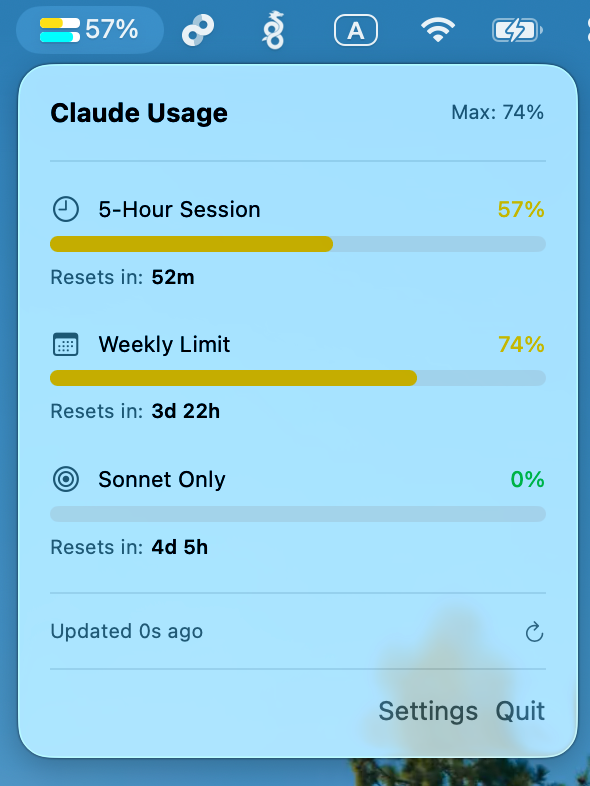

# Usage4AI

A macOS menu bar app for monitoring Claude API usage.



## Features

- Real-time 5-hour and 7-day usage monitoring
- Menu bar progress bars with percentage display
- Customizable refresh intervals (30s - 10m)
- Usage alerts when exceeding 90%
- Auto-retry on network failure

## Requirements

- macOS 15.0+
- [Claude Code CLI](https://github.com/anthropics/claude-code) (for OAuth token)

## Installation

Download from [Releases](https://github.com/lion9453/Usage4AI/releases) or build from source:

```bash
git clone https://github.com/lion9453/Usage4AI.git
cd Usage4AI
xcodebuild -scheme Usage4AI -configuration Release build
```

## Disclaimer

This is an unofficial tool, not affiliated with Anthropic. Usage data may differ from official dashboard.

## License

[AGPL-3.0](LICENSE)

Copyright 2026 [lion9453](https://github.com/lion9453)
